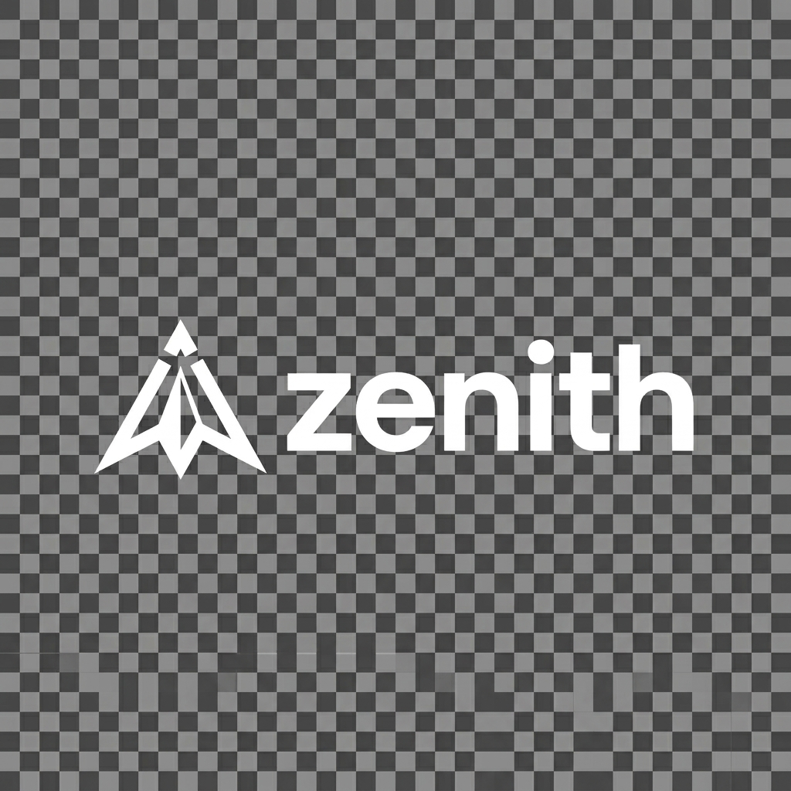

<p align="center">
  
</p>

<h1 align="center">ZENITH</h1>

<p align="center">
  <strong>An Agentic AI-Powered Platform for Semantic Job Discovery, Personalized Application Optimization, and Intelligent Career Management</strong>
</p>

<p align="center">
  <a href="https://ai-career-forge-sable.vercel.app/"></a>
  
  
  
  
  
</p>

---

## 🧭 Overview

**Zenith** is a production-grade, full-stack career management platform that automates the entire job application lifecycle using **Agentic Retrieval-Augmented Generation (RAG)** and **semantic vector search**.

Users upload their resume (parsed by Google Gemini AI + PDFBox), discover semantically matched jobs from the Adzuna API using **MongoDB Atlas Vector Search** (768-dimensional embeddings), and generate fully tailored application kits — ATS-optimised resumes in two templates, cover letters, email introductions, and interview preparation kits — with a single click.

> **Major Project (CSD0703)** — Submitted in partial fulfilment for the degree of **B.Tech in Computer Science Engineering** at **ITM University, Gwalior (M.P.)**, Session 2022–2026.

---

## ✨ Key Features

| Module | Description |
|---|---|
| **🔐 Auth & User Management** | JWT-based authentication with OAuth 2.0 Google login, BCrypt hashing, role-based access (USER / ADMIN) |
| **📄 AI Resume Parsing** | Intelligent resume upload → AWS S3 storage → AI-based parsing via Gemini + PDFBox → structured profile extraction (skills, experience, projects, certifications) |
| **🔍 Semantic Job Discovery** | Live job fetching from Adzuna API → 768-dimensional vector embeddings → MongoDB Atlas Vector Search with cosine similarity → multi-factor match scoring (65–100) with AI explanations |
| **🚀 One-Click Application Kit** | Agentic RAG pipeline: tailored resumes (Modern + Classic), cover letters, email intros, and interview prep kits — all generated and stored as PDFs via Thymeleaf + OpenHTMLtoPDF |
| **📊 Application Tracker** | Full lifecycle tracking: **SAVED → APPLIED → INTERVIEW → OFFER** with archiving and deletion support |
| **⚡ Real-Time Sync** | Background job synchronisation via Spring `@Async` + Server-Sent Events (SSE) with persistent sync status |
| **🤖 Floating AI Assistant** | Context-aware Gemini-powered career Q&A available on every dashboard page |
| **📱 Responsive Design** | Mobile-first TailwindCSS layout with dark/light theme toggle and glassmorphism UI |
| **🏢 Brand Intelligence** | Adaptive company logo fetching via Brandfetch API with theme-aware container backgrounds |

---

## 🏗️ Architecture

Zenith implements a **three-tier architecture** separating presentation, application, and data layers:

```
┌──────────────────────────────────────────────────────────────────┐
│                    CLIENT LAYER (Next.js 15 SPA)                 │
│   Zustand State │ TailwindCSS + shadcn/ui │ Axios + JWT Auth     │
├──────────────────────────────────────────────────────────────────┤
│                    API LAYER (Spring Boot 3.3)                   │
│   Spring Security │ Spring AI (Gemini) │ REST Controllers        │
│   @Async + SSE │ Thymeleaf PDF Engine │ S3 Integration           │
├──────────────────────────────────────────────────────────────────┤
│                    DATA LAYER (MongoDB Atlas)                    │
│   users │ user_profiles │ jobs (768-dim vectors) │ applications  │
│   job_sync_status │ Vector Search Index (cosine)                 │
└──────────────────────────────────────────────────────────────────┘
```

---

## 🛠️ Tech Stack

### Backend
| Technology | Purpose |
|---|---|
| **Java 21** | Core language |
| **Spring Boot 3.3** | Application framework |
| **Spring AI** | LLM orchestration (Google Gemini 2.0 Flash) |
| **Spring Security** | JWT authentication & authorization |
| **MongoDB Atlas** | Primary database with Vector Search |
| **AWS S3** | Resume & generated PDF storage |
| **Thymeleaf + OpenHTMLtoPDF** | Server-side PDF rendering |
| **Apache PDFBox** | Resume text extraction |

### Frontend
| Technology | Purpose |
|---|---|
| **Next.js 15** (App Router) | React framework with SSR |
| **TailwindCSS + shadcn/ui** | Styling & component library |
| **Zustand** | Global state management |
| **Lucide React** | Icon system |
| **Axios** | HTTP client with JWT interceptors |

### External APIs
| Service | Purpose |
|---|---|
| **Google Gemini AI** | Resume parsing, RAG workflows, AI assistant |
| **Adzuna API** | Real-time global job listings |
| **Brandfetch API** | Company brand & logo intelligence |

---

## 📂 Repository Structure

```
zenith/
├── ai-career-forge-backend/        # Spring Boot REST API
│   ├── src/main/java/              # Controllers, Services, Models
│   ├── src/main/resources/         # Thymeleaf templates, configs
│   └── pom.xml                     # Maven dependencies
│
├── ai-career-forge-frontend/       # Next.js 15 Application
│   ├── src/app/                    # App Router pages & layouts
│   ├── src/components/             # Reusable UI components
│   ├── src/store/                  # Zustand state stores
│   └── public/                     # Zenith branding assets
│
├── .env.example                    # Environment variable template
└── zenithMajorProjectReport.pdf    # Full project report
```

---

## 🚀 Getting Started

### Prerequisites
- **JDK 21**
- **Node.js 20+** & npm
- **MongoDB Atlas Cluster** (with Vector Search enabled)
- **Google AI API Key** (Gemini 2.0 Flash)
- **Adzuna API Credentials** (App ID + App Key)
- **AWS S3 Bucket** (for document storage)

---

### ⚙️ Backend Setup

1. **Navigate to the backend directory**:
   ```bash
   cd ai-career-forge-backend
   ```

2. **Configure Environment Variables** — create `.env.development`:
   ```env
   # Database
   MONGODB_URI=your_mongodb_atlas_uri

   # Authentication
   JWT_SECRET=your_jwt_secret_key

   # AI Configuration (Gemini)
   GOOGLE_AI_API_KEY=your_gemini_api_key

   # Job API (Adzuna)
   ADZUNA_APP_ID=your_adzuna_id
   ADZUNA_APP_KEY=your_adzuna_key

   # AWS S3
   AWS_ACCESS_KEY_ID=your_access_key
   AWS_SECRET_ACCESS_KEY=your_secret_key
   AWS_REGION=us-east-1

   # Brand Intelligence
   BRANDFETCH_API_KEY=your_brandfetch_key
   ```

3. **Build & Run**:
   ```bash
   mvn clean package -DskipTests
   mvn spring-boot:run
   ```

---

### 🌐 Frontend Setup

1. **Navigate to the frontend directory**:
   ```bash
   cd ai-career-forge-frontend
   ```

2. **Install Dependencies**:
   ```bash
   npm install
   ```

3. **Run the Development Server**:
   ```bash
   npm run dev
   ```
   Open [http://localhost:3000](http://localhost:3000) to view the app.

---

## 🧬 Vector DB Configuration (MongoDB Atlas)

To enable semantic job matching, create a **Vector Search Index** in your Atlas UI:

1. Create an index named `vector_index` on the `vector_store` collection.
2. Use the following JSON configuration:
   ```json
   {
     "fields": [
       {
         "numDimensions": 768,
         "path": "embedding",
         "similarity": "cosine",
         "type": "vector"
       }
     ]
   }
   ```

> [!NOTE]
> We use **768 dimensions** for Google's `text-embedding-004` / `gemini-embedding-001` model with cosine similarity.

---

## 📈 Performance Metrics

| Metric | Achieved | Target |
|---|---|---|
| Resume Parsing | < 3 seconds | < 5 seconds |
| Semantic Recommendation | < 1.5 seconds | < 2 seconds |
| Full Application Kit | < 10 seconds | < 15 seconds |
| API Response Time | 50–200 ms | < 300 ms |
| Database Vector Query | 30–80 ms | < 100 ms |
| Bundle Size (gzipped) | ~180 KB | < 250 KB |

---

## 🔒 Security

| Feature | Implementation |
|---|---|
| Password Hashing | BCrypt |
| JWT Tokens | HS256, 7-day expiration |
| Protected Routes | Middleware JWT verification |
| Input Validation | Frontend + Backend sanitization |
| XSS Prevention | React auto-escaping + CSP |
| CORS | Whitelist frontend domain |
| Environment Variables | `.env` excluded from version control |
| Rate Limiting | API request throttling |

---

## 🚢 Deployment

| Layer | Platform | Details |
|---|---|---|
| **Frontend** | Vercel | Optimised for Next.js with edge functions |
| **Backend** | Render / AWS | Dockerised Spring Boot service |
| **Database** | MongoDB Atlas | Managed cluster with Vector Search |
| **Storage** | AWS S3 | Secure presigned URLs for documents |

> **Live Demo**: [ai-career-forge-sable.vercel.app](https://ai-career-forge-sable.vercel.app/)

---

## 🛣️ Roadmap

- [x] Google Gemini AI integration for production stability
- [x] Agentic RAG workflows for complete application kits
- [x] MongoDB Atlas Vector Search with 768-dim embeddings
- [x] Real-time SSE background synchronisation
- [x] Floating AI career assistant
- [x] Adaptive brand intelligence with Brandfetch
- [x] Application tracker with archive/delete functionality
- [x] Mobile-responsive dashboard with hamburger menu
- [ ] Multi-modal profile analysis (video introductions)
- [ ] PWA with offline support via service workers
- [ ] Advanced analytics dashboard
- [ ] Map integration for location-based job discovery

---

## 👥 Team

| Name | Enrollment No. | Role |
|---|---|---|
| **Bhuvnesh Pal** | BETN1CS22279 | Full-Stack Lead / AI Architecture |
| **Kushank Rawat** | BETN1CS22256 | Backend & Database Engineering |
| **Saurya Chauhan** | BETN1CS22242 | Frontend & UI/UX Design |

**Guide**: Ms. Anjali Saraswat, Associate Professor, Dept. of CSE, ITM University, Gwalior

---

## 📚 References

Key references from the project report:
1. Spring AI Reference Documentation — [docs.spring.io](https://docs.spring.io/spring-ai/reference/)
2. MongoDB Atlas Vector Search — [mongodb.com](https://www.mongodb.com/docs/atlas/atlas-vector-search/)
3. Next.js 15 Documentation — [nextjs.org](https://nextjs.org/docs)
4. Google Gemini API — [ai.google.dev](https://ai.google.dev)
5. Lewis et al. (2020) — *Retrieval-Augmented Generation for Knowledge-Intensive NLP Tasks*, NeurIPS
6. Yao et al. (2023) — *ReAct: Synergizing Reasoning and Acting in Language Models*, arXiv

---

## 🤝 Contributing

We welcome contributions! Please feel free to submit a Pull Request.

## 📄 License

This project is licensed under the MIT License.

---

<p align="center">
  <sub>© 2026 Zenith Intelligence — ITM University, Gwalior</sub>
</p>